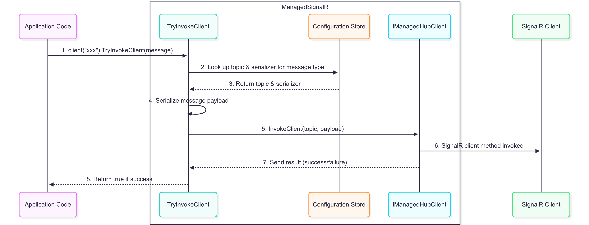

# 🚀 ManagedSignalR

A powerful .NET library that provides a structured, topic-based approach to SignalR hub management with automatic command routing, custom serialization, and clean separation of concerns.

---

## 🔄 Communication Flow

ManagedSignalR supports two message flows :

- **`InvokeServer(topic, payload)`** *(implemented in the server-side library)* – Client-to-Server communication, where the client sends a message to the server with a specified topic and serialized payload.


- **`InvokeClient(topic, payload)`** *(implemented on the client)* – Server-to-Client communication. **Do not call this directly**; instead, use **`TryInvokeClientAsync(message)`** to ensure correct routing and serialization.


---

## ✨ Features

- 🎯 **Topic-Based Routing**: Route messages using string topics instead of method names  
- 🧩 **Command Handler Pattern**: Clean separation of message handling logic using dedicated handler classes automatically registered via DI  
- ⚡ **Flexible Serialization**: Support for custom serializers and deserializers per message type  
- 🔒 **Type-Safe Client Communication**: Strongly typed messaging with automatic topic resolution  
- 🔄 **Connection Lifecycle Hooks**: Override-friendly connection and disconnection event handling  
- 🌐 **Managed Hub Context**: Access hub functionality from outside the hub using `IManagedHubContext<THub>` instead of `IHubContext<THub, IManagedHubClient>`  
- 🚀 **Fire-and-Forget Processing**: Asynchronous command processing with built-in error handling  

---

## 📦 Installation

Install the package via NuGet:

```bash
dotnet add package ManagedSignalR
```

## 🏁 Quick Start

In your `Startup.cs` or `Program.cs`, configure the ManagedSignalR services:

```csharp

builder.Services.AddManagedSignalR(config =>
{
    /* FIRST HUB */
    config.AddManagedHub<AppHub>()

        // Configure outgoing messages (server to client)
        .ConfigureInvokeClient<Alert>(cfg =>
            cfg.RouteToTopic("alert")
                .UseSerializer(obj => JsonSerializer.Serialize(obj)))


        // Configure incoming messages (client to server)  
        .ConfigureInvokeServer<Coordinates>(cfg =>
            cfg.OnTopic("gps")
                // coordinates are received as "lat,long"
                .UseDeserializer(str =>
                {
                    var parts = str.Split(',');
                    return new Coordinates
                    {
                        Latitude = double.Parse(parts[0]), // assuming the 1st part is latitude
                        Longitude = double.Parse(parts[1]) // assuming the 2nd part is longitude
                    };
                })
                .UseHandler<CoordinatesHandler>())


        .ConfigureInvokeClient<Message>(cfg =>
            // Configure outgoing messages (server to client) for "msg" topic
            // do not specify a serializer, it will use the default JSON serializer
            cfg.RouteToTopic("msg"));


    /* SECOND HUB */
    //config.AddManagedHub<ChatHub>()...

});
```
Not to forget the default SignalR registration  :
```
builder.Services.AddSignalR(); 
// add Redis backplane for distributed SignalR ...
```
### 2. Create Your Hub

Implement your hub by inheriting from `ManagedHub`. You can choose to override the connection lifecycle hooks for ``OnConnectedHookAsync`` and ``OnDisconnectedHookAsync``to run custom logic when clients connect or disconnect. 

```csharp
public class AppHub : ManagedHub
{
    protected override async Task OnConnectedHookAsync()
    {
        var connectionId = Context.ConnectionId;

        // Determine Early or Late group based on current time
        var now = DateTime.Now;
        string timeGroup = now.Hour < 12 ? "EarlyUsers" : "LateUsers";

        // Add user to groups
        await Groups.AddToGroupAsync(connectionId, timeGroup);

        var alert = new Alert()
        {
            Content = $"Welcome! You belong within our {timeGroup} group"
        };

        // Optionally send a welcome message
        await Clients.Caller.TryInvokeClientAsync(alert);
    }

    protected override async Task OnDisconnectedHookAsync()
    {
        var connectionId = Context.ConnectionId;

        // Remove from all possible groups
        await Groups.RemoveFromGroupAsync(connectionId, "EarlyUsers");
        await Groups.RemoveFromGroupAsync(connectionId, "LateUsers");
    }
}
```

### 3. Create Message Handlers
``IHubCommandHandler<>`` command handlers are instantiated to handle incoming commands once they have been deserialized. These are _automatically registered_ with the dependency injection container and can receive injected dependencies:

```csharp
public class CoordinatesHandler : IHubCommandHandler<Coordinates>
{
    private readonly IManagedHubContext<AppHub> _hubContext;

    public CoordinatesHandler(IManagedHubContext<AppHub> hubContext)
    {
        _hubContext = hubContext;
    }

    public async Task Handle(Coordinates request, HubCallerContext context)
    {

        Console.WriteLine($"User {context.UserIdentifier} is at {request.Latitude}, {request.Longitude}");
        
        var message = new Message
        {
            Text = $"Location received successfully! ({request.Latitude},{request.Longitude})"
        };

        // use IManagedHubContext<> to invoke client
        await _hubContext.Clients.Client(context.ConnectionId).TryInvokeClientAsync(message);
    }
}
```

### 4. Map Your Hub

```csharp
app.UseEndpoints(endpoints =>
{
    endpoints.MapHub<AppHub>("/apphub");
});
```

## Usage

### Client-Side Communication

From JavaScript/TypeScript:

```javascript
const connection = new signalR.HubConnectionBuilder()
    .withUrl("/chathub")
    .build();

// Listen for messages from server

connection.on("InvokeClient", (topic, payload) => {
    switch (topic) {
        case "alert":
            const alert = JSON.parse(payload);
            console.log(`ALERT!!!\t${alert?.Content}`);
            break;

        case "msg":
            const msg = JSON.parse(payload);
            console.log(`NEW MESSAGE*\t${msg?.Text}`);
            break;

        default:
            console.log(`[unexpected topic]\t${topic} => ${payload}`);
            break;
    }
});

// Send message to server
connection.invoke("InvokeServer", "gps", "40.7128,-74.0060");

connection.start();
```

### Accessing Hub from Other Code

To access hub functionality from controllers, services, or other parts of your application, inject `IManagedHubContext<THub>` instead of the default SignalR `IHubContext<THub, IManagedHubClient>`:

```csharp
[ApiController]
[Route("api/[controller]")]
public class NotificationController : ControllerBase
{
    private readonly IManagedHubContext<ChatHub> _hubContext;
    
    public NotificationController(IManagedHubContext<ChatHub> hubContext)
    {
        _hubContext = hubContext;
    }
    
    [HttpPost("broadcast")]
    public async Task<IActionResult> BroadcastAlert([FromBody] Alert alert)
    {
        await _hubContext.Clients.All.TryInvokeClientAsync(alert);
        return Ok();
    }
}
```

## Configuration Options

### Serialization

Configure custom serializers for outgoing messages:

```csharp
.ConfigureInvokeClient<MyMessage>(cfg =>
    cfg.RouteToTopic("my-topic")
       .UseSerializer(obj => MyCustomSerializer.Serialize(obj)))
```

### Deserialization

Configure custom deserializers for incoming messages:

```csharp
.ConfigureInvokeServer<MyCommand>(cfg =>
    cfg.OnTopic("my-command")
       .UseDeserializer(json => MyCustomDeserializer.Deserialize<MyCommand>(json))
       .UseHandler<MyCommandHandler>())
```

### Default JSON Serialization

If no custom serializer is specified, `System.Text.Json` is used by default:

```csharp
.ConfigureInvokeClient<Message>(cfg =>
    cfg.RouteToTopic("message")) // Uses default JSON serialization
```

## Advanced Features

### Connection Lifecycle

Override connection hooks for custom logic:

```csharp
public class AppHub : ManagedHub
{
    protected override async Task OnConnectedHookAsync()
    {
        var connectionId = Context.ConnectionId;

        // Determine Early or Late group based on current time
        var now = DateTime.Now;
        string timeGroup = now.Hour < 12 ? "EarlyUsers" : "LateUsers";

        // Add user to groups
        await Groups.AddToGroupAsync(connectionId, timeGroup);

        var alert = new Alert()
        {
            Content = $"Welcome! You belong within our {timeGroup} group"
        };

        // Optionally send a welcome message
        await Clients.Caller.TryInvokeClientAsync(alert);
    }

    protected override async Task OnDisconnectedHookAsync()
    {
        var connectionId = Context.ConnectionId;

        // Remove from all possible groups
        await Groups.RemoveFromGroupAsync(connectionId, "EarlyUsers");
        await Groups.RemoveFromGroupAsync(connectionId, "LateUsers");
    }
}
```


## Requirements

- .NET 6.0 or later
- Microsoft.AspNetCore.SignalR
- System.Text.Json (for default serialization)

## License

This project is licensed under the MIT License - see the [LICENSE](LICENSE) file for details.

## Examples

For more examples and usage patterns, check out the `/examples` folder in the repository.

---

**ManagedSignalR** - Making SignalR hubs more manageable, one topic at a time! 🚀
